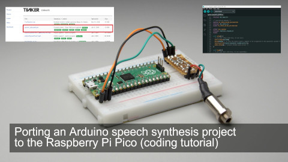

<h1 align="center">speech_daisybell</h1>
<h3 align="center"> a simple Arduino project that synthesizes the classic song "Daisy Bell"</h3>  
<p align="center"> 
  <br>
  <a href="https://youtu.be/Pm4Z5yXaRCk">link to the video</a>
</p>

`speech_daisybell` is a simple Arduino project that synthesizes the classic song "Daisy Bell" (aka *Bicycle Built for Two*) using software speech synthesis. The original code was sourced from a project hosted on Google Code Archive and has been updated to be compatible with newer platforms, allowing it to be compiled and run using the Arduino IDE.

## Original Source

The original code was downloaded from the now-archived Google Code project *tinkerit*. The original `speech_daisybell.pde` file can still be accessed via the following link:

- [speech_daisybell.pde (Google Code Archive)](https://storage.googleapis.com/google-code-archive-downloads/v2/code.google.com/tinkerit/speech_daisybell.pde)

Unfortunately, the original author is unknown as there was no attribution on the archived project.

## Project Overview

This project utilizes simple software-based speech synthesis techniques to produce an audible version of "Daisy Bell." It is lightweight and can run on most Arduino-compatible boards.

### Features
- **Ported for Arduino IDE**: The project has been updated from the original `.pde` format to `.ino` to be compatible with modern versions of the Arduino IDE.
- **Platform Support**: Works with a variety of Arduino boards including newer platforms.
- **Simple setup**: Just connect a speaker to the correct output pin and upload the sketch via the Arduino IDE.

## Installation and Usage

1. Clone or download this repository to your local machine:
   ```bash
   git clone https://github.com/yourusername/speech_daisybell.git
   ```

2. Open the `speech_daisybell.ino` file in the [Arduino IDE](https://www.arduino.cc/en/Main/Software).

3. Connect your Arduino board to your computer and make sure it is properly selected in the Arduino IDE:
   - Go to **Tools > Board** and select the appropriate board.
   - Go to **Tools > Port** and select the correct port for your device.

4. Connect a speaker to the designated output pin (this may depend on your specific setup, refer to the comments in the code for details).

5. Click **Upload** to compile and upload the code to your Arduino board.

6. Enjoy the "Daisy Bell" song being synthesized by your Arduino!

## Requirements

- **Hardware**: Any Arduino-compatible board (e.g., Arduino Uno, Mega, Nano).
- **Software**: Arduino IDE 1.8.x or newer.

## Contributions

Feel free to contribute to this project! If you've found bugs or have improvements, open an issue or submit a pull request.

## License

This project is licensed under the MIT License. See the [LICENSE](./LICENSE) file for more details.
